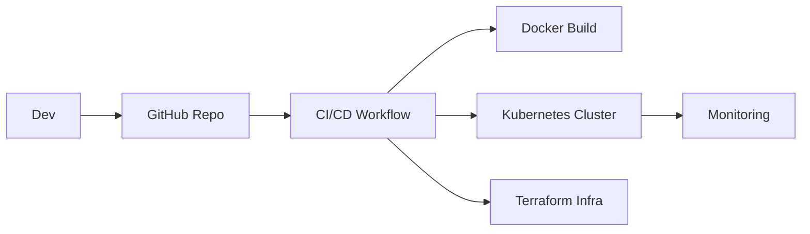

# 🚀 Optimizing Deployment Speed and Reliability with DevOps

This project demonstrates a full DevOps lifecycle with a focus on rapid, reliable, and scalable deployment using modern DevOps practices. It integrates CI/CD, Docker, Kubernetes, Infrastructure as Code (IaC), and monitoring to streamline software delivery.

---

## 🧱 Project Structure

```
devops-project/
├── app/                     # Node.js sample application
├── docker/                  # Dockerfile and docker-compose
├── .github/workflows/       # GitHub Actions CI/CD pipeline
├── k8s/                     # Kubernetes manifests
├── terraform/               # Infrastructure as Code (AWS)
├── monitoring/              # Prometheus/Grafana configs
├── scripts/                 # Health check scripts
└── README.md                # This file
```

---

## 🛠️ Technologies Used

* Node.js (sample app)
* Docker & Docker Compose
* GitHub Actions for CI/CD
* Kubernetes (deployment + service)
* Terraform (AWS provisioning)
* Prometheus & Grafana (monitoring)

---

## 🧪 Test-Driven Development

Basic HTTP tests written in Jest:

app.test.js

```js
const request = require('supertest');
const app = require('./index'); // Ensure app is exported
test('Health check', async () => {
  const res = await request(app).get('/');
  expect(res.statusCode).toBe(200);
});
```

Run tests:

```bash
npm test
```

---

## 🧱 Containerization & Orchestration

Start locally using Docker Compose:

```bash
cd docker
docker-compose up --build
```

Deploy to Kubernetes:

```bash
kubectl apply -f k8s/
```

---

## 🔄 CI/CD Pipeline (GitHub Actions)

Trigger: On push to main
Pipeline steps:

1. Checkout repo
2. Install dependencies
3. Run tests
4. Build Docker image
5. Deploy to Kubernetes

Config file: .github/workflows/ci-cd.yml

---

## ☁️ Infrastructure as Code (Terraform)

Provision an EC2 instance:

```bash
cd terraform
terraform init
terraform plan
terraform apply
```

Tip: Use variables.tf and outputs.tf for modularity.

---

## 📈 Monitoring & Observability

Prometheus configuration in monitoring/prometheus.yml
Optional: Add Grafana via Docker Compose

Grafana service snippet:

```yaml
grafana:
  image: grafana/grafana
  ports:
    - "3001:3000"
```

---

## 🔒 Security Enhancements

* Dockerfile uses non-root user
* Kubernetes secrets instead of plaintext
* Role-based access control (RBAC) in Kubernetes
* Hardened container images

---

## 📊 Architecture Diagram

You can generate this using draw\.io or a markdown diagram tool like Mermaid:

mermaid example:



---

## 📎 Future Enhancements

* Add autoscaling (K8s HPA)
* Integrate Slack/Webhook alerts from Prometheus
* Canary deployments using Istio or Argo Rollouts

---

## 📬 Contact

Project by [Adithya Gojo](https://github.com/adithya-gojo)
Feel free to contribute or raise issues via GitHub!

---


